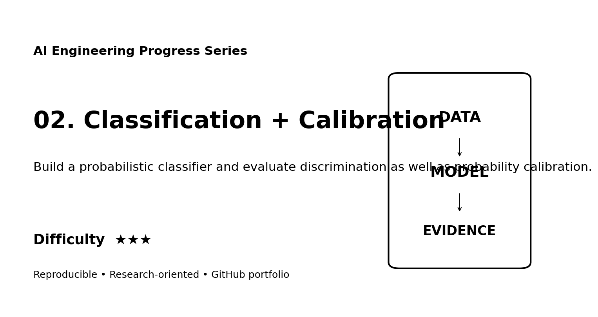
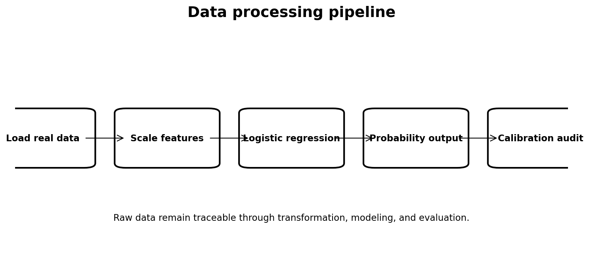
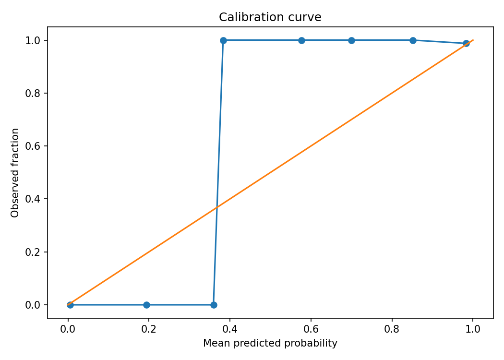
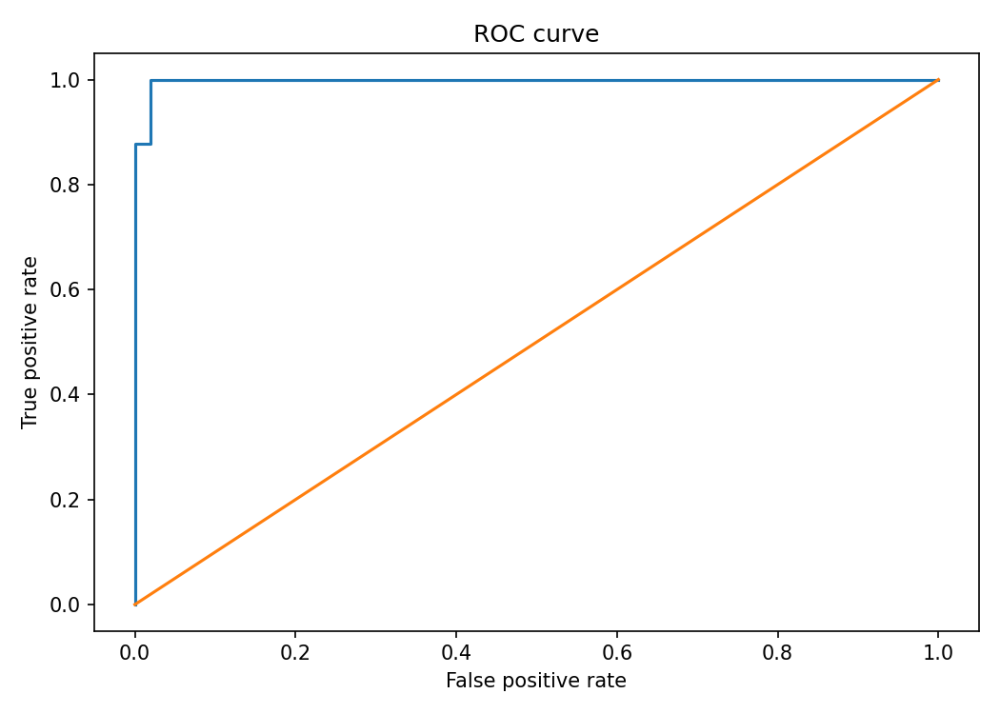

# Web Portfolio Card

## Classification + Calibration

**Track:** AI Engineering  
**Difficulty:** ★★★  
**Dataset:** Wisconsin Diagnostic Breast Cancer dataset  
**Quick description:** Build a probabilistic classifier and evaluate discrimination as well as probability calibration.

### Suggested website image gallery

### Suggested portfolio copy
This project demonstrates classification, probability calibration, ROC-AUC, Brier score using a reproducible workflow with explicit data provenance, processing, evaluation, limitations, and research documentation. The repository includes executable code and a scientific-style technical report suitable for supervisor review.
