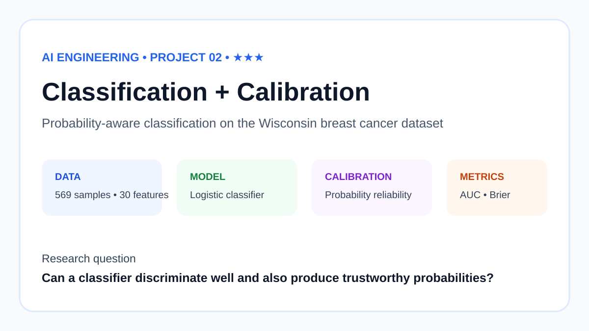
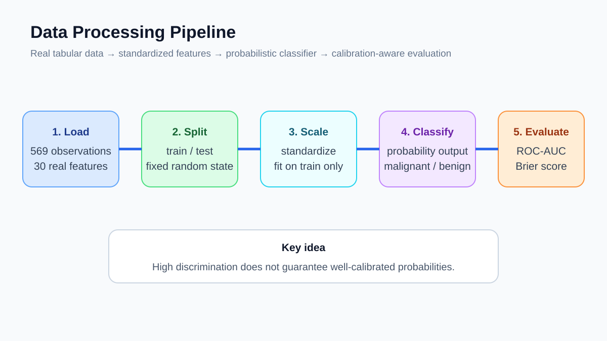

# Classification and Probability Calibration

[](https://github.com/devissaputra/classification_calibration/actions/workflows/ci.yml)



A reproducible comparison of **uncalibrated logistic regression, sigmoid calibration, and isotonic calibration** on the Wisconsin Diagnostic Breast Cancer benchmark.

## Question

A classifier can rank cases correctly while still producing probabilities that are too confident or too cautious. This project asks:

> Does post-hoc calibration improve the quality of logistic-regression probabilities on a held-out test set?

The test set is untouched during fitting and calibration. Sigmoid and isotonic calibration are learned with five-fold cross-validation inside the training data.

## Data

- 569 observations
- 30 numerical features
- binary target
- stratified 75/25 train/test split
- fixed seed: 42

The dataset is loaded directly from scikit-learn. See [DATA.md](DATA.md) for provenance.

## Method



All three variants use the same standardized logistic-regression base model:

1. **Uncalibrated** logistic regression
2. **Sigmoid** calibration using cross-validated Platt-style scaling
3. **Isotonic** calibration using cross-validated isotonic regression

I report discrimination and probability-quality metrics together:

- **ROC-AUC** for ranking quality
- **Brier score** for squared probability error
- **Log loss** for probabilistic fit
- **ECE (10 bins)** as a simple calibration diagnostic
- **Accuracy** at a 0.5 decision threshold

## Recorded results

| Model | Accuracy | ROC-AUC | Brier ↓ | Log loss ↓ | ECE-10 ↓ |
|---|---:|---:|---:|---:|---:|
| Uncalibrated | 0.9860 | 0.9977 | 0.0181 | 0.0679 | 0.0310 |
| Sigmoid | 0.9790 | 0.9979 | 0.0273 | 0.1152 | 0.0769 |
| Isotonic | 0.9720 | 0.9981 | **0.0179** | **0.0657** | 0.0345 |

The result is intentionally not framed as “calibration always helps.” On this split, logistic regression is already strong. Isotonic calibration slightly improves Brier score and log loss, while the simple binned ECE estimate does not improve. With only 143 test cases, small differences should not be overinterpreted.

Generated metrics live in [results/metrics.json](results/metrics.json).

## Run

```bash
python -m venv .venv
source .venv/bin/activate
pip install -r requirements.txt
python src/run_experiment.py
```

Windows activation:

```powershell
.venv\Scripts\activate
```

Generated plots are written to `results/figures/`; the curated SVGs in `assets/` remain stable portfolio graphics.

## Test

```bash
pip install pytest
pytest
```

The tests check both repository structure and experiment behaviour, including the calibration-error implementation and metric output.

## Repository map

```text
assets/                 curated explanatory graphics
paper/                  technical write-up and LaTeX source
results/metrics.json    recorded experiment output
src/run_experiment.py   import-safe experiment module
tests/                  behavioural and structure tests
DATA.md                 dataset provenance
ETHICS.md               deployment limits
REPRODUCIBILITY.md      exact rerun procedure
```

## How I read the result

The interesting part is that calibration is not automatically beneficial. The uncalibrated logistic model is already very strong on this split. Isotonic calibration slightly improves Brier score and log loss, while the binned ECE estimate changes very little. With only 143 test cases, those differences are small enough that I would want repeated splits before drawing a stronger conclusion.

## Deployment caveat

This is a probability-calibration benchmark, not a clinical model. Calibration can shift across hospitals, devices, prevalence levels, and time. A real deployment study would need external validation, subgroup analysis, uncertainty estimates, and clinical governance. The repository must not be used for diagnosis or treatment decisions; see [ETHICS.md](ETHICS.md).
