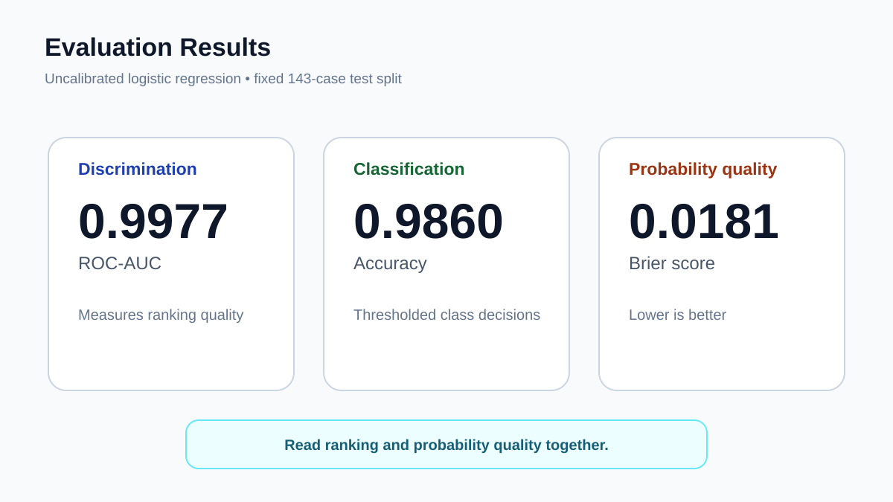

# 02. Classification + Calibration ★★★


> **Quick description:** Build a probabilistic classifier and evaluate both discrimination and probability calibration on real diagnostic data.

## Why this project matters
This AI Engineering project uses the **Wisconsin Diagnostic Breast Cancer dataset** to demonstrate an end-to-end probabilistic classification workflow with explicit preprocessing, real-data evaluation, and calibration-aware interpretation.

A classifier can rank cases well while still assigning unreliable probabilities. This project therefore evaluates both **discrimination** and **probability quality** instead of reporting accuracy alone.

## Dataset
- **Dataset:** Wisconsin Diagnostic Breast Cancer
- **Source:** scikit-learn's `load_breast_cancer`
- **Samples:** 569
- **Features:** 30 numerical predictors
- **Data provenance and usage:** [DATA.md](DATA.md)

## Data-processing mechanism


### Processing steps
1. Load the real dataset.
2. Split into training and held-out test data.
3. Standardize features using training data only.
4. Fit a probabilistic classifier.
5. Generate class probabilities on the test set.
6. Evaluate accuracy, ROC-AUC, and Brier score.

## Model and probability view


The key distinction is between:
- **Classification:** which class the model predicts.
- **Discrimination:** how well the model ranks positive and negative cases.
- **Calibration:** whether predicted probabilities correspond to observed frequencies.

## Evaluation results


Generated metrics from the included experiment:

```json
{
  "accuracy": 0.986013986013986,
  "roc_auc": 0.9976939203354298,
  "brier": 0.01806692891806697,
  "n": 569
}
```

### Interpretation
- **Accuracy 0.9860** indicates very few thresholded classification errors on the held-out test set.
- **ROC-AUC 0.9977** indicates excellent ranking discrimination.
- **Brier score 0.0181** indicates low mean squared probability error, but calibration should still be inspected rather than inferred from AUC alone.

## Reproduce
```bash
python -m venv .venv
source .venv/bin/activate   # Windows: .venv\Scripts\activate
pip install -r requirements.txt
python src/run_experiment.py
```

Metrics are written to `results/metrics.json`.

## Research documentation
- [Scientific-style technical report](paper/paper.md)
- [Quick description](QUICK_DESCRIPTION.md)
- [Website-ready portfolio entry](PORTFOLIO.md)
- [Data provenance](DATA.md)
- [Reproducibility notes](REPRODUCIBILITY.md)
- [Ethics and responsible use](ETHICS.md)
- [Citation metadata](CITATION.cff)

## Difficulty
**★★★ — intermediate**

## Academic integrity
This repository is a research portfolio artifact, not a peer-reviewed publication. Reported metrics are generated from the included code and stated real dataset.

## Stronger research extension
A more publication-oriented version would add explicit reliability diagrams, expected calibration error, Platt/isotonic recalibration comparisons, repeated cross-validation, confidence intervals, and external validation on a second diagnostic dataset.
