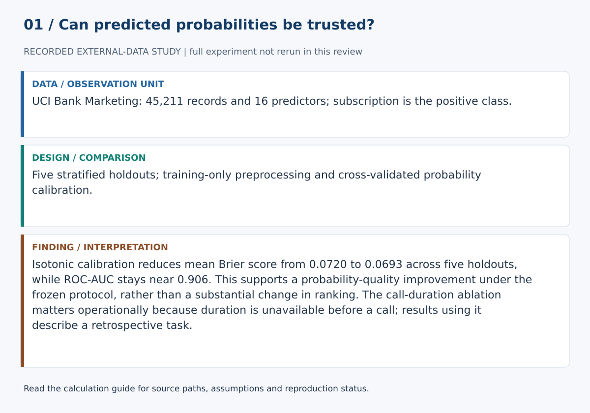
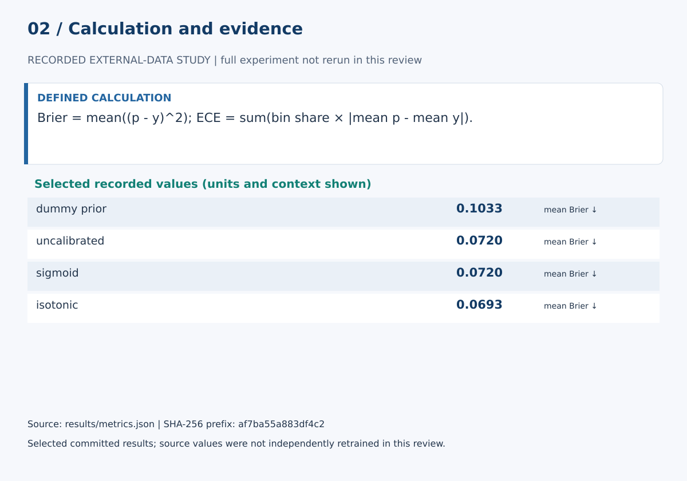

# Probability Calibration Under Class Imbalance: A Reproducible Study on UCI Bank Marketing

## Abstract

Probability calibration can look convincing on a single split while remaining sensitive to the split, calibration procedure, and calibration metric. This study compares a class-prior baseline and logistic regression under uncalibrated, sigmoid-calibrated, and isotonic-calibrated conditions on UCI Bank Marketing. The protocol combines an untouched primary holdout, five repeated stratified holdouts, multiple probability-quality metrics, calibration-fold sensitivity, ECE-bin sensitivity, an operational feature ablation, primary-split error analysis, and descriptive paired bootstrap intervals. Numerical results are generated directly by the executable pipeline.

## Research question

How do sigmoid and isotonic calibration alter logistic-regression probability quality and discrimination on UCI Bank Marketing, and how stable are those changes across repeated splits and sensitivity checks?

## Data

The study uses UCI Bank Marketing, dataset 222, DOI 10.24432/C5K306, licensed CC BY 4.0. The runner extracts bank-full.csv from the official UCI archive and records the exact raw CSV SHA-256, sample count, predictor count, and positive-class prevalence.

## Related work

Probability calibration evaluates whether predicted probabilities correspond to observed frequencies rather than only whether a classifier ranks cases correctly. The protocol follows the established distinction between discrimination and probabilistic calibration, using the Brier score alongside log loss and calibration diagnostics. Sigmoid and isotonic post-hoc calibration are included as standard supervised calibration approaches; expected calibration error is treated as a bin-dependent descriptive metric rather than a universal scalar truth.

## Methods

### Preprocessing

Numeric predictors are median-imputed and standardized. Categorical predictors are mode-imputed and one-hot encoded with unknown-category tolerance. All preprocessing is fitted inside the training pipeline.

### Conditions

The primary comparison contains a class-prior dummy baseline, uncalibrated logistic regression, five-fold sigmoid-calibrated logistic regression, and five-fold isotonic-calibrated logistic regression.

### Evaluation

The primary split uses seed 42 with a stratified 80/20 partition. Robustness is assessed with seeds 13, 29, 42, 73, and 101. Ranking is assessed with ROC-AUC and average precision. Probability quality is assessed with Brier score, log loss, and expected calibration error. Accuracy at threshold 0.5 is retained as a secondary descriptive measure.

### Sensitivity analyses

The study varies calibration cross-validation folds across 3, 5, and 10 and recomputes ECE with 5, 10, and 20 equal-width bins. The primary design is also rerun without duration because call duration is unavailable before a marketing call occurs.

### Uncertainty reporting

Repeated holdouts reuse observations and are not independent experiments. The study therefore reports descriptive means and standard deviations plus paired split-level bootstrap intervals over 4,000 resamples, without p-values or claims of formal statistical significance.

### Error analysis

For each primary model, the runner records confusion counts, overall error rate, number of errors made with at least 0.80 prediction confidence, and the mean predicted probability among false positives and false negatives when those error types are present.

## Results

Generated numerical results are written to paper/results.md, paper/results.tex, and results/summary.md. The complete sensitivity, ablation, error-analysis, environment, and uncertainty records are stored in results/metrics.json. The LaTeX manuscript imports its generated result section rather than duplicating numerical values by hand.

Under the frozen current protocol, isotonic calibration improves probability-quality metrics more materially than sigmoid calibration while leaving ranking performance nearly unchanged. The duration-removal ablation also shows that retrospective performance is substantially stronger when the post-contact duration variable is available, reinforcing the need to separate methodological calibration findings from a pre-contact deployment claim.

## Validity and limitations

The study is a methodological benchmark on historical marketing data. It does not establish causal effects, present-day validity, fairness, cross-institution transportability, or suitability for consequential banking decisions. Expected calibration error also depends on binning, which is why multiple bin counts are reported.

## Reproducibility

The executable protocol is src/run_experiment.py. Generated evidence is stored in results/metrics.json, results/repeated_runs.csv, results/summary.md, results/figures, and paper/results.md.

## References

- Brier, G. W. (1950). Verification of forecasts expressed in terms of probability. *Monthly Weather Review*, 78(1), 1–3.
- Niculescu-Mizil, A., & Caruana, R. (2005). Predicting good probabilities with supervised learning. *Proceedings of ICML 2005*, 625–632. DOI: 10.1145/1102351.1102430.
- Guo, C., Pleiss, G., Sun, Y., & Weinberger, K. Q. (2017). On calibration of modern neural networks. *Proceedings of Machine Learning Research*, 70, 1321–1330.
- Moro, S., Cortez, P., & Rita, P. (2014). A data-driven approach to predict the success of bank telemarketing. *Decision Support Systems*, 62, 22–31. DOI: 10.1016/j.dss.2014.03.001.
- Moro, S., Rita, P., & Cortez, P. (2014). *Bank Marketing* [Dataset]. UCI Machine Learning Repository. DOI: 10.24432/C5K306.

## Calculation definitions and evidence audit

Brier = mean((p - y)^2); ECE = sum(bin share × |mean p - mean y|).

Lower Brier and log loss indicate better probability predictions. ECE depends on the chosen bins; a constant prevalence forecast can have low ECE while having no discrimination. Split bootstrap intervals are descriptive because holdouts overlap.

Isotonic calibration reduces mean Brier score from 0.0720 to 0.0693 across five holdouts, while ROC-AUC stays near 0.906. This supports a probability-quality improvement under the frozen protocol, rather than a substantial change in ranking. The call-duration ablation matters operationally because duration is unavailable before a call; results using it describe a retrospective task.

The [calculation guide](../CALCULATIONS.md) provides exact evidence paths and a function-level implementation map.

### Selected evidence and interpretation

| Quantity | Value | Unit / meaning | JSON path |
|---|---:|---|---|
| dummy_prior | 0.10330837430613315 | mean Brier ↓ | `repeated_summary.dummy_prior.brier.mean` |
| uncalibrated | 0.07198757353865393 | mean Brier ↓ | `repeated_summary.logistic_uncalibrated.brier.mean` |
| sigmoid | 0.07197467863115595 | mean Brier ↓ | `repeated_summary.logistic_sigmoid.brier.mean` |
| isotonic | 0.06927224756658759 | mean Brier ↓ | `repeated_summary.logistic_isotonic.brier.mean` |

These values are read from `results/metrics.json`. They must be interpreted with the split, data status and limitations above. The complete data/model experiment was not rerun in this review. Stored empirical results were inspected, not independently reproduced from raw data.

### Reproduction and claim boundaries

The existing suite requires unavailable dependencies; no full-suite pass is claimed. The figure generator can be checked with `python scripts/build_review_figures.py --check`. This verifies the displayed calculation evidence, not an independent replication of the complete scientific experiment. The manuscript is a working report, not a peer-reviewed publication.
